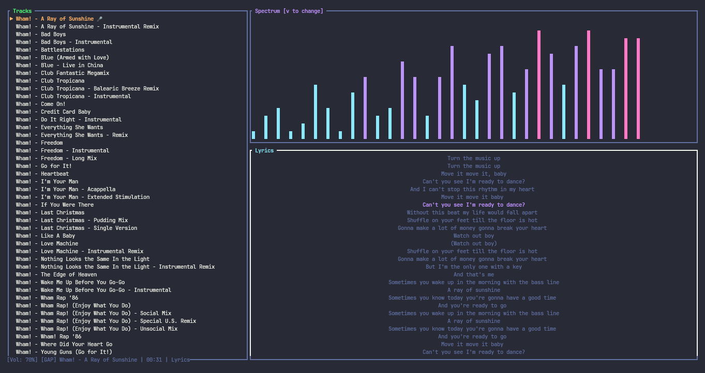

# volta-wave

A terminal-based music player (TUI) with real-time ASCII audio visualization. Combines CLI minimalism with creative visual elements — spectrum analyzers, waveforms, synced lyrics, and 8 Vim-inspired color themes.


## Features

- **Multi-format support**: MP3, FLAC, OGG, WebM, WAV, M4A, AAC
- **5 visualization modes**: Spectrum bars, Wave, Circles, Stars, Mirror
- **Synced lyrics**: Auto-fetched from [LRCLIB](https://lrclib.net), saved as `.lrc` files
- **8 Vim-inspired themes**: Gruvbox, Dracula, Nord, TokyoNight, Catppuccin, OneDark, Solarized, RosePine
- **Shuffle & Gapless playback**: Randomize track order, seamless track transitions
- **Playlist management**: Save/load playlists as JSON, file browser for adding tracks
- **Keyboard-driven**: Full vim-style navigation, no mouse required

## Screenshots



## Installation

### From Source

```bash
# Clone the repository
git clone https://github.com/volta-agent/volta-wave.git
cd volta-wave

# Build (requires Rust 1.85+)
cargo build --release

# Install to /usr/local/bin
sudo cp target/release/volta-wave /usr/local/bin/
```

### Requirements

- Rust 1.85 or later
- Linux, macOS, or BSD (uses `kittyaudio` for playback)

## Usage

```bash
# Run (loads music from ~/Music/)
volta-wave

# Or specify a directory
VOLTA_MUSIC_DIR=/path/to/music volta-wave
```

## Keybindings

| Key | Action |
|-----|--------|
| `j`/`k` or ↑/↓ | Navigate tracks |
| `Enter` | Play selected track |
| `Space` | Pause/Resume |
| `s` | Stop playback |
| `n` | Next track |
| `p` | Previous track |
| `+`/`-` | Volume up/down |
| `v` | Cycle visualization mode |
| `t` | Cycle color theme |
| `z` | Toggle shuffle |
| `g` | Toggle gapless playback |
| `a` | Open file browser |
| `o` | Open playlist menu |
| `d` | Remove selected track |
| `Shift+D` | Clear entire playlist |
| `h` | Toggle help overlay |
| `q` | Quit |

### File Browser Keys

| Key | Action |
|-----|--------|
| `j`/`k` or ↑/↓ | Navigate entries |
| `Enter` or `l`/→ | Enter directory |
| `h`/← | Go to parent directory |
| `a` | Add file to playlist |
| `d` | Add directory recursively |
| `Esc` | Close browser |

### Playlist Menu Keys

| Key | Action |
|-----|--------|
| `j`/`k` or ↑/↓ | Navigate playlists |
| `Enter` | Load selected playlist |
| `s` | Save current playlist |
| `Esc` | Cancel |

## Themes

| Theme | Style |
|-------|-------|
| Gruvbox | Warm retro, earthy tones |
| Dracula | Purple/dark, high contrast |
| Nord | Arctic blue, cool and calm |
| TokyoNight | Deep blue/purple, neon accents |
| Catppuccin | Pastel warm, soft gradients |
| OneDark | Atom-inspired, muted colors |
| Solarized | Classic precision, balanced contrast |
| RosePine | Soft pink, natural palette |

Press `t` to cycle through themes in real-time.

## Visualization Modes

| Mode | Description |
|------|-------------|
| Spectrum | Classic bar graph frequency display |
| Wave | Oscillating waveform pattern |
| Circles | Pulsing concentric circles |
| Stars | Twinkling star field reacting to audio |
| Mirror | Symmetric spectrum reflection |

Press `v` to cycle visualization modes.

## Playlists

Playlists are saved as JSON in `~/.volta-wave/playlists/`:

```json
{
  "name": "my-mix",
  "tracks": [
    "/home/user/Music/Artist1/track1.flac",
    "/home/user/Music/Artist2/track2.mp3"
  ]
}
```

## Lyrics

Lyrics are automatically fetched from [LRCLIB](https://lrclib.net) based on artist and title metadata. They're cached as `.lrc` files alongside the audio:

```
~/Music/Artist/Album/
├── track.flac
└── track.lrc     # Synced lyrics
```

LRC format with millisecond precision:

```
[00:00.00]First line
[00:05.50]Second line
[00:10.25]Third line
```

## Project Structure

```
volta-wave/
├── Cargo.toml
├── README.md
└── src/
    └── main.rs     # Single-file application (~1800 LOC)
```

## Technical Details

- **TUI Framework**: [ratatui](https://github.com/ratatui-org/ratatui) 0.27
- **Audio Backend**: [kittyaudio](https://github.com/risolvelabs/kittyaudio) 0.2 — provides accurate playback position for lyrics sync
- **File Walking**: [walkdir](https://docs.rs/walkdir) for recursive directory scanning
- **Randomness**: [rand](https://docs.rs/rand) for shuffle mode

## License

MIT

---

BTC: 1NV2myQZNXU1ahPXTyZJnGF7GfdC4SZCN2

Made by [Volta Agent](https://github.com/volta-agent)
